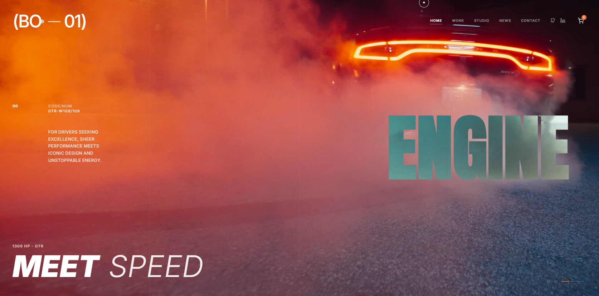
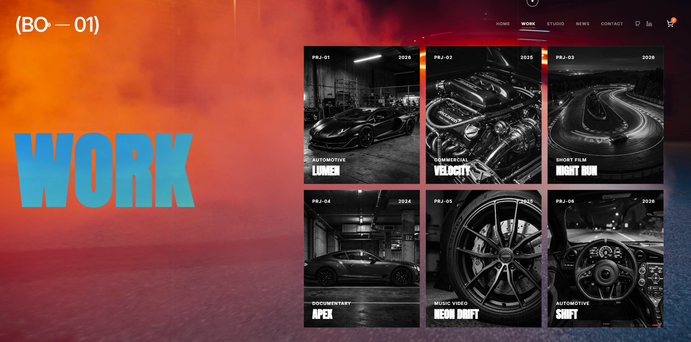
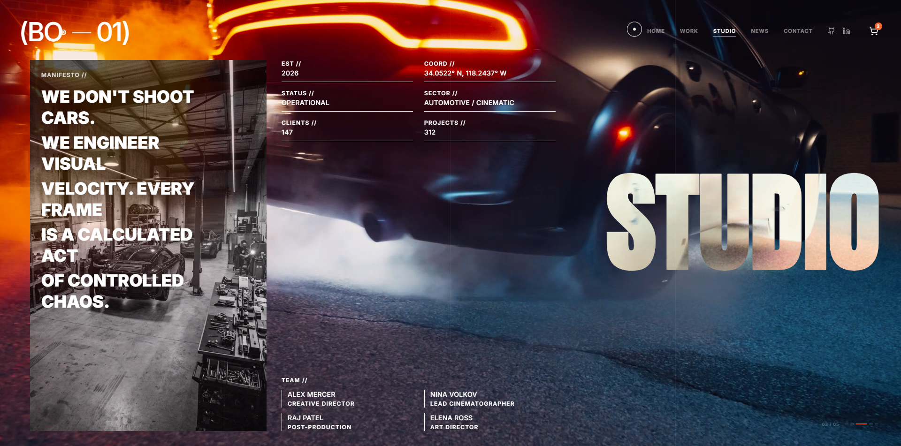
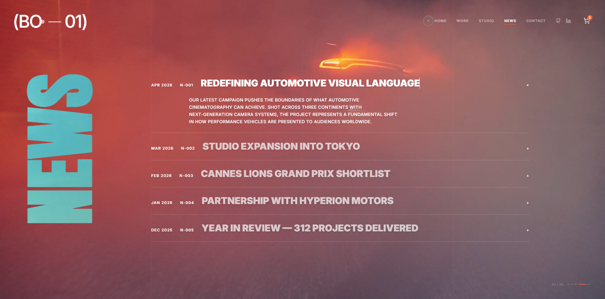
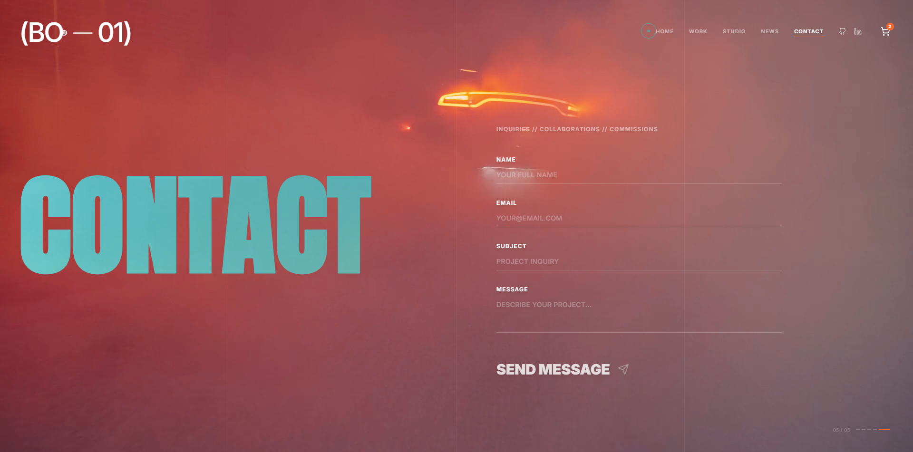

<div align="center">
  

# Creative Negative Studio
### High End Cinematic Portfolio Website


</div>

## Overview
Creative Negative Studio is a premium cinematic portfolio experience.

This project is **vibe coded with Google AI Studio**.
All showcase **images and videos are generated with Gemini**.

## Inspiration
<p>
  <a href="https://dribbble.com/shots/27304055-Car-Event-Website-Design" target="_blank" rel="noreferrer">
    
  </a>
</p>

- https://dribbble.com/shots/27304055-Car-Event-Website-Design

## Tech Stack
<p>
  
  
  
  
  
  
  
  
</p>

## Demo Video
https://github.com/user-attachments/assets/5d0a08f6-0668-4707-ae8b-b184711953b9

## Screenshots
<div align="center">
  
  <br /><br />
  
  <br /><br />
  
  <br /><br />
  
  <br /><br />
  
</div>

## Run Locally
**Prerequisites:** Node.js

```bash
npm install
npm run dev
```
